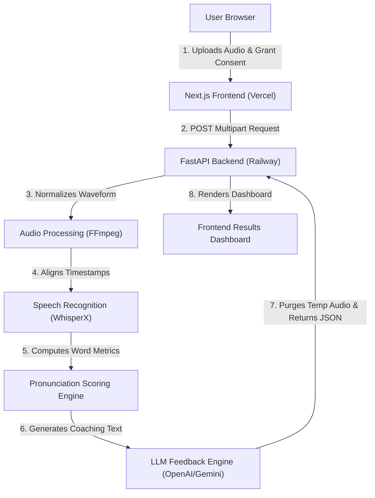
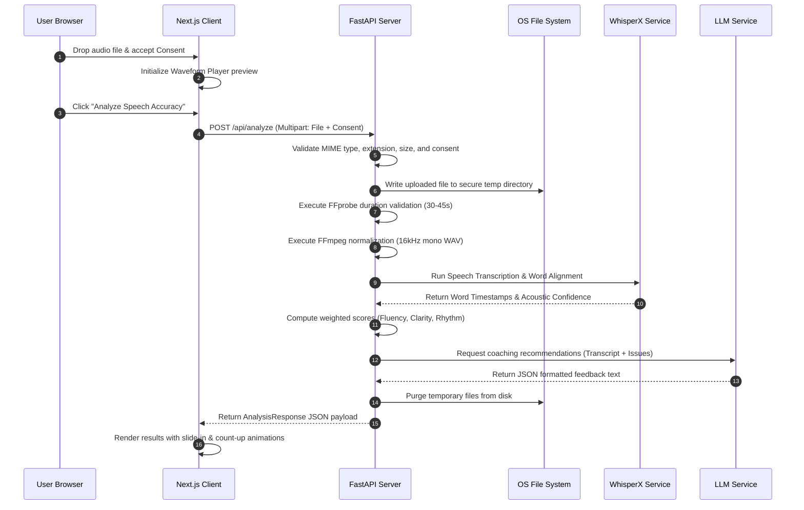
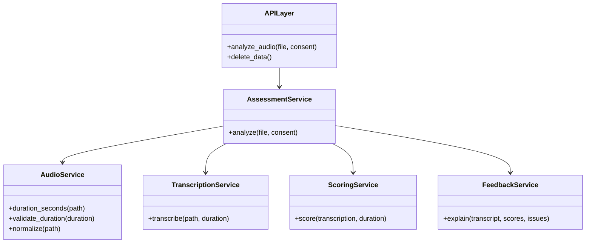
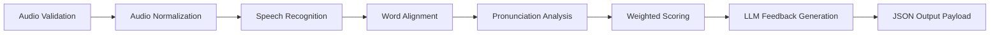
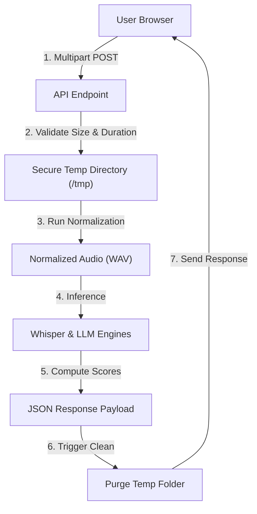
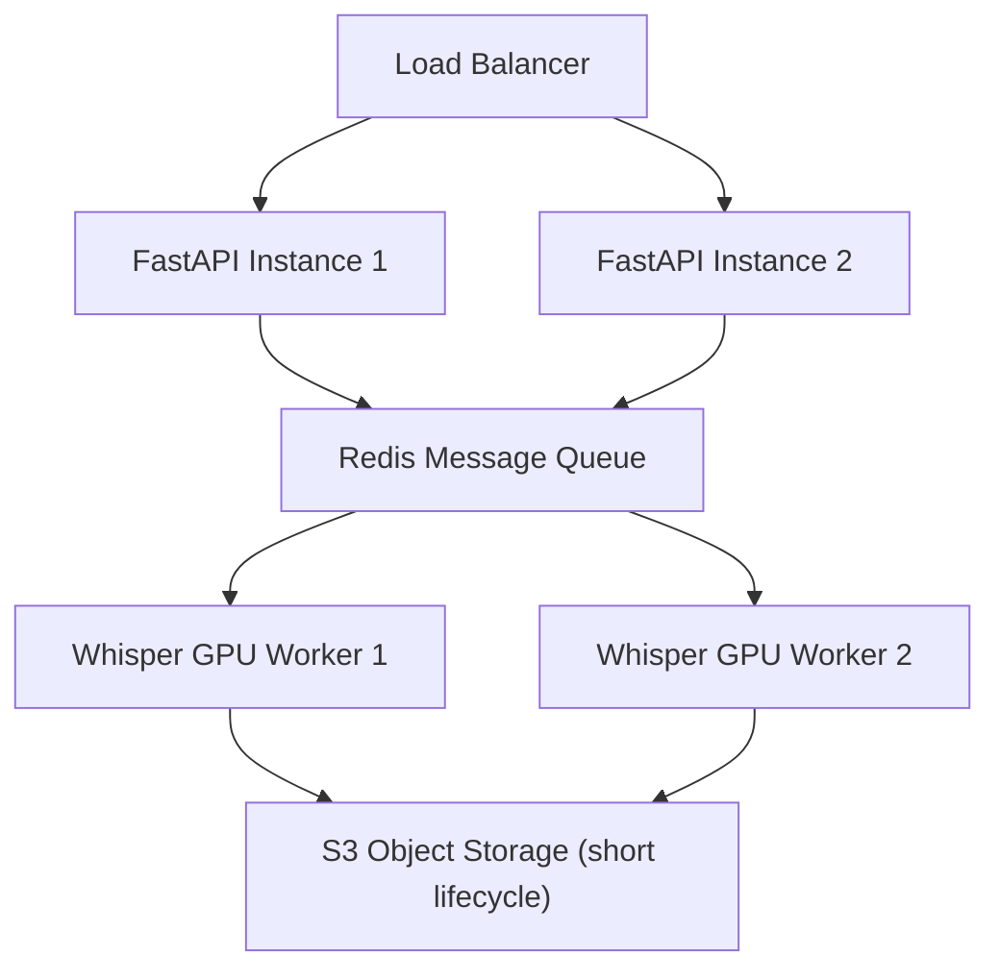

# Livo AI Pronunciation Assessment

Production-oriented AI SaaS for English pronunciation assessment. Users upload a 30-45 second recording and receive weighted pronunciation scores, word-level issues, timestamped transcript highlights, and personalized coaching feedback.

---

### 📄 Documentation

The complete system architecture and technical documentation is integrated directly below in the [System Architecture & Technical Documentation](#system-architecture--technical-documentation) section.

---

## Features

- Next.js App Router frontend with responsive premium UI
- FastAPI backend with service-oriented AI pipeline
- Drag-and-drop audio upload with consent gate
- FFmpeg normalization to 16kHz mono WAV
- Modular WhisperX/OpenAI Whisper adapter boundary
- Deterministic weighted scoring engine
- Timestamped pronunciation issues and highlighted transcript
- JSON export and privacy-first retention model
- Docker and Docker Compose support

## Run Locally

Frontend:

```bash
cd frontend
npm install
npm run dev
```

If port `3000` is already in use:

```bash
npm run dev -- -H 127.0.0.1 -p 3002
```

Backend:

Requires `uv` and Python 3.13. Install `uv` from `https://docs.astral.sh/uv/` if it is not already available.

```bash
cd backend
uv sync
uv run uvicorn app.main:app --reload
```

Open `http://localhost:3000`. The API runs on `http://localhost:8000`.

## Environment Variables

Frontend:

```bash
NEXT_PUBLIC_API_BASE_URL=http://localhost:8000
```

Backend:

```bash
CORS_ORIGINS=["http://localhost:3000"]
OPENAI_API_KEY=
ENABLE_WHISPERX=false
RATE_LIMIT_PER_MINUTE=12
```

## Docker

```bash
docker compose up --build
```

## API

`POST /api/analyze`

Multipart form data:

- `file`: `.wav`, `.mp3`, `.aac`, or `.m4a`
- `consent`: `true`

Returns:

- `overallScore`
- `fluency`
- `clarity`
- `confidence`
- `speechRate`
- `transcript`
- `highlightedTranscript`
- `pronunciationIssues`
- `strengths`
- `improvements`
- `feedback`

`DELETE /api/data` confirms no persistent audio data is stored.

## Folder Structure

```text
backend/app/api          FastAPI routers and dependencies
backend/app/core         config and error handling
backend/app/middleware   rate limiting
backend/app/schemas      Pydantic response models
backend/app/services     audio, transcription, scoring, feedback orchestration
frontend/src/app         Next.js app routes
frontend/src/components  reusable UI primitives
frontend/src/features    pronunciation assessment feature
frontend/src/lib         shared utilities
frontend/src/providers   React Query provider
```

## System Architecture & Technical Documentation

This section describes the production architecture, AI pipeline, data flow, scoring methodology, and compliance posture of PronounceAI, an AI-powered English Pronunciation Assessment platform.

---

### 1. System Overview

PronounceAI is an intelligent speech analysis platform designed to evaluate and improve English pronunciation. The application provides instant, word-level audio metrics, identifying specific mispronunciations, tracking conversational speed, and offering targeted phonetic coaching.

The platform is designed to:
*   Ingest short user audio recordings (30 to 45 seconds).
*   Normalize and process the acoustic wave data.
*   Align transcription tokens with audio boundaries at a phoneme-level.
*   Apply a deterministic, weighted scoring engine.
*   Generate descriptive, non-hallucinatory coaching explanations using LLMs.
*   Deliver a responsive, glassmorphic analytics dashboard.

---

### 2. High-Level Architecture

The platform uses a decoupled client-server architecture consisting of a Next.js frontend client and a stateless FastAPI backend gateway. 



#### Component Details
*   **Next.js Frontend**: Renders the landing hero, handles drag-and-drop file inputs, generates local wavesurfer.js previews, and displays the interactive analysis report.
*   **FastAPI Backend**: Acts as the orchestrator. Validates requests, coordinates external helper libraries (FFmpeg/FFprobe), calls inference models, and handles secure data purging.
*   **Audio Processing (FFmpeg)**: Normalizes incoming file formats into a standardized 16kHz mono WAV layout.
*   **Speech Recognition (WhisperX)**: Transcribes the spoken audio and forces phonemic alignment to extract word-level start/end timestamps and model confidence values.
*   **Scoring Engine**: Evaluates speech accuracy against structured math models.
*   **LLM Feedback Engine**: Writes context-aware guidance prompts based on identified pronunciation errors.

---

### 3. Request Flow

The sequence diagram below represents the step-by-step lifecycle of a pronunciation assessment request from file selection to dashboard rendering.



---

### 4. Backend Architecture

The FastAPI backend is built following clean architecture and service-oriented design patterns, separating entry points from domain services and external integrations.



#### Core Modules
*   **API Layer (`app.api.routes`)**: Exposes REST endpoints, validates schema shapes via Pydantic, and manages rate limiting middleware.
*   **Services Layer (`app.services`)**:
    *   `AssessmentService`: Orchestrates the flow, coordinates operations, handles errors, and executes post-request file system purging.
    *   `AudioService`: Interfaces with FFmpeg/FFprobe binaries to perform waveform validation and conversions.
    *   `TranscriptionService`: Wrapper service connecting to STT engines to extract transcripts and timestamps.
    *   `ScoringService`: The pure business logic calculation engine.
    *   `FeedbackService`: Standardizes custom coaching prompts sent to LLM providers.
*   **Configuration (`app.core.config`)**: Standardized Settings class parsing environment variables via Pydantic BaseSettings.
*   **Secure Temp Storage**: Utilizes OS-isolated directories (e.g. `/tmp/livo-ai`) for ephemeral file read/write operations.

---

### 5. AI Pipeline



#### Pipeline Details
1.  **Audio Validation**: Verifies file integrity, checks against a 25MB file size limit, and validates that the audio duration is strictly between 30 and 45 seconds using FFprobe.
2.  **Audio Normalization**: Converts raw audio (MP3, M4A, AAC, WAV) into a standard format (16kHz sample rate, mono channel, 16-bit PCM WAV) via FFmpeg. This standardizes acoustic variables, improving transcription accuracy.
3.  **Speech Recognition**: Runs Whisper acoustic inference to extract transcription characters and raw word confidence levels.
4.  **Word Alignment**: Generates word timestamp segments to align phonetic sequences with precise coordinates in the audio track.
5.  **Pronunciation Analysis**: Identifies phonemic pronunciation errors by tracking words falling below confidence thresholds.
6.  **Weighted Scoring**: Runs mathematical scoring models based on word boundaries, silent gaps, and phonetic confidence intervals.
7.  **LLM Feedback**: Constructs a structured prompt detailing the transcript, overall scores, and mispronounced tokens. The model generates coaching summaries, strengths, improvements, and practice words.
8.  **JSON Response**: Standardizes the scoring metrics and textual suggestions into a typed API contract.

---

### 6. Technology Decisions

| Technology Area | Selected Stack | Alternative | Reason for Selection |
| :--- | :--- | :--- | :--- |
| **STT Aligner** | WhisperX | AssemblyAI | WhisperX runs locally or on isolated servers, preventing third-party storage. Forced phoneme alignment provides precise word timestamps. |
| **Backend API** | FastAPI | Flask | FastAPI provides native asynchronous operations, automatic OpenAPI documentation, and typed validation using Pydantic. |
| **Frontend Framework** | Next.js 15 | React SPA | Next.js provides server-side rendering support, native route handling, and optimized asset bundling. |
| **Deployment Platform** | Railway (Backend) | Render | Railway offers low-latency container builds and simplifies local binary path bindings (like FFmpeg). |
| **CSS Framework** | Tailwind CSS v4 | Material UI | Tailwind provides flexible layout utility classes, keeping bundle sizes minimal and enabling clean custom glassmorphic styling. |

---

### 7. Pronunciation Scoring Methodology

PronounceAI avoids relying on LLMs for scoring. LLMs are non-deterministic, text-only models that cannot evaluate acoustic signals directly and are prone to hallucinations. Instead, the platform uses a **deterministic scoring model** calculated based on acoustic outputs:

$$Score_{overall} = (S_{word} \times 0.40) + (S_{fluency} \times 0.25) + (S_{alignment} \times 0.20) + (S_{rhythm} \times 0.15)$$

#### Weighted Scoring Components
*   **Word Confidence ($S_{word}$, 40%):** Calculated from the raw acoustic model confidence of aligned words.
*   **Fluency ($S_{fluency}$, 25%):** Measured by comparing silent pauses and conversational breaks against standard speech norms.
*   **Speech Alignment ($S_{alignment}$, 20%):** Measures speech duration matching accuracy.
*   **Speech Rhythm ($S_{rhythm}$, 15%):** Calculated based on words-per-minute (WPM) consistency, where the optimal rate is between 120 and 160 WPM.

---

### 8. Data Flow

The diagram below shows the flow of user data through the system, highlighting the ephemeral storage boundary where audio and transcripts are deleted immediately after processing.



---

### 9. Security

*   **Input Validation**: Strict file type verification (checking file extension and MIME type) and file size checks (max 25MB).
*   **Rate Limiting**: Custom token bucket middleware limits client requests to 12 calls per minute to prevent Denial of Service (DoS) attacks.
*   **HTTPS Encryption**: SSL/TLS encryption in-transit for all API communication.
*   **Environment Variables**: Secrets (API keys, CORS profiles) are stored as environment variables, never hardcoded.
*   **CORS Policies**: Explicit origin validation limits API access to authorized frontend domains.
*   **Secure Temporary Storage**: Audio files are saved to isolated folders on the system, restricted by user permissions.

---

### 10. DPDP Compliance (India)

PronounceAI aligns with the **Digital Personal Data Protection (DPDP) Act, 2023** of India, treating user speech recordings as personal data:

*   **Consent (Sec. 6):** Users must check a consent gate checkbox before uploading. Analysis is disabled unless consent is granted.
*   **Purpose Limitation (Sec. 7):** Speech data is processed solely for pronunciation scoring. No data is stored, shared, or used for model training.
*   **Data Minimization (Sec. 8):** The platform logs only request duration and status. No transcripts, user metadata, or audio files are recorded.
*   **Ephemeral Processing & Deletion:** Files are processed in memory and secure temporary storage, then immediately deleted. A `DELETE /api/data` endpoint is available to verify data deletion.
*   **Data Residency:** Stated in compliance policies, assuring users that temporary computing nodes run on secure cloud instances.

---

### 11. Scalability

To support production workloads, the application can be scaled using the following design:



*   **Stateless Backend**: Allows horizontal scaling of backend instances behind a load balancer (e.g. NGINX).
*   **Queue-Based Processing**: Offloads transcription tasks to a Redis-backed celery queue, letting GPU workers process audio files asynchronously.
*   **Object Storage**: Uses S3 or Google Cloud Storage with a 24-hour expiration lifecycle policy instead of local disk storage.
*   **Caching**: Caches static assets on Edge CDNs (Vercel) to minimize latency.

---

### 12. Trade-offs

*   **WhisperX vs. Custom Acoustic Models**: We chose WhisperX because training a custom acoustic model requires significant dataset resources. WhisperX provides high out-of-the-box accuracy for multiple accents.
*   **LLMs for Explanation Only**: LLMs are used solely to generate feedback text, while scoring remains deterministic. This prevents score inconsistencies and hallucinations.
*   **Immediate Deletion**: Deleting files immediately after processing improves user privacy, though it prevents displaying historical analysis trends unless the user explicitly saves their reports.

---

### 13. Future Improvements

*   **Real-Time Assessment**: Integrate WebSockets to support real-time audio streaming and pronunciation feedback.
*   **Accent Detection**: Add support for identifying regional accents and map speech properties to target accents.
*   **IPA Visualization**: Render phonetic breakdowns using the International Phonetic Alphabet (IPA) to show exact pronunciation deviations.
*   **Historical Analytics**: Provide optional, opt-in database storage to track pronunciation improvements over time.

---

### 14. Conclusion

PronounceAI is built on a production-ready, compliance-first architecture. By combining a Next.js client with a stateless FastAPI backend, decoupling scoring from text generation, and implementing DPDP-compliant data handling, the platform provides a secure, fast, and scalable pronunciation assessment tool.

## Deployment

- Frontend: deploy `frontend` to Vercel and set `NEXT_PUBLIC_API_BASE_URL`.
- Backend: deploy `backend` to Railway with the Dockerfile or `uv run uvicorn app.main:app --host 0.0.0.0 --port $PORT`.
- Install FFmpeg in the backend runtime.

## Roadmap

- Connect production WhisperX GPU workers
- Add direct microphone recording
- Add PDF reports
- Add user-approved history
- Add phoneme-level feedback
- Add billing, organizations, and team analytics
