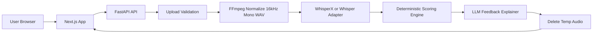
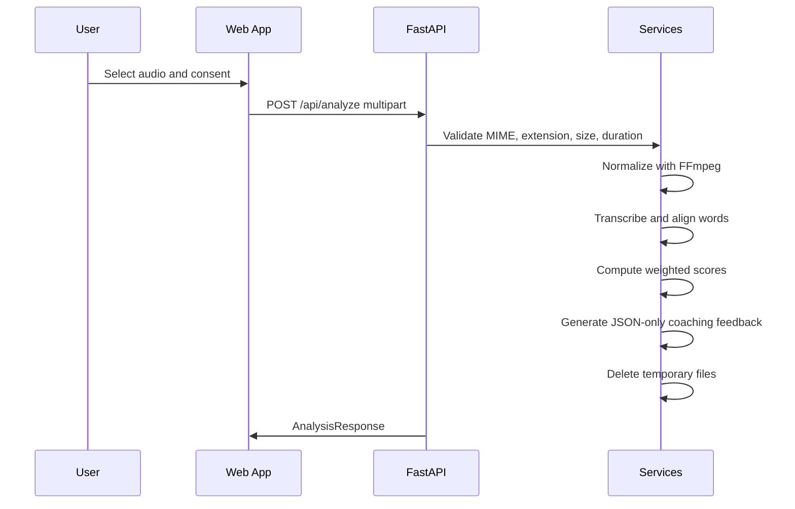

# Livo AI Pronunciation Assessment Architecture

## Overview

Livo AI is a production-oriented English pronunciation assessment SaaS. The product is split into a Next.js web client and a FastAPI analysis service. Audio is processed ephemerally: upload, validate, normalize, transcribe, score, explain, delete.

## Data Flow

## API Flow

`POST /api/analyze` accepts multipart form data:

- `file`: WAV, MP3, AAC, or M4A
- `consent`: required boolean

It returns overall, fluency, clarity, confidence, speech rate, transcript highlights, timestamped issues, feedback, strengths, and improvements.

`DELETE /api/data` confirms no persistent user audio or transcript data is retained.

## AI Pipeline

1. Validate extension, MIME type, size, and 30-45 second duration.
2. Normalize audio through FFmpeg to 16kHz mono WAV.
3. Transcribe through a swappable WhisperX/OpenAI Whisper adapter.
4. Score deterministically with configurable weights:
   - 40% word confidence
   - 25% fluency
   - 20% alignment quality
   - 15% rhythm
5. Identify word-level pronunciation issues from low confidence and timing signals.
6. Send transcript and metadata to an LLM explainer. The LLM must explain scores, not invent them.
7. Delete uploaded and normalized files.

## Component Explanation

Frontend:

- `UploadCard`: consent, format guidance, drag-and-drop upload.
- `Processing`: animated pipeline state.
- `Results`: score ring, metrics, transcript tokens, issue timeline, JSON export.
- `api.ts`: typed client boundary.

Backend:

- `AudioService`: storage, validation, FFmpeg/FFprobe.
- `TranscriptionService`: Whisper adapter boundary.
- `ScoringService`: deterministic scoring and issue extraction.
- `FeedbackService`: strict feedback explainer boundary.
- `AssessmentService`: orchestration and cleanup.

## Technology Choices

Next.js App Router gives deployable React Server/Client composition on Vercel. FastAPI gives typed Python services and OpenAPI documentation. FFmpeg is industry-standard audio normalization. WhisperX is the preferred alignment path for word timestamps; the adapter allows production deployments to enable it without changing API contracts.

## Alternatives Considered

- Browser-only scoring: rejected because reliable pronunciation assessment needs server-side audio normalization and model orchestration.
- Fully LLM-based scoring: rejected because scores must come from acoustic and alignment features.
- Permanent history by default: deferred because privacy and DPDP requirements favor temporary processing first.

## Trade-offs

The current local adapter produces deterministic sample transcription when WhisperX is not enabled, which keeps development and CI lightweight. Production should connect the adapter to WhisperX/OpenAI Whisper and persist only explicit user-approved history metadata.

## Scaling Strategy

- Move analysis to a job queue for longer workloads.
- Store temporary files in isolated object storage with lifecycle expiry.
- Use GPU workers for WhisperX alignment.
- Add Redis-backed rate limiting.
- Cache static frontend assets at the edge.

## Monitoring

- Log request IDs, validation failures, processing duration, and model latency.
- Avoid logging raw transcript/audio unless explicit diagnostic consent is granted.
- Track error rate, queue latency, and analysis completion rate.

## DPDP And Privacy Decisions

- Consent is required before upload.
- Purpose is limited to pronunciation assessment.
- Uploaded audio is temporary and deleted after processing.
- No permanent storage is created by default.
- No model training uses customer recordings.
- Logs are intentionally minimal.

## Future Improvements

- Direct microphone recording.
- PDF report generation.
- Optional user-owned history with explicit retention controls.
- Accent estimation.
- Per-phoneme scoring and syllable stress feedback.
- Admin analytics and billing.
